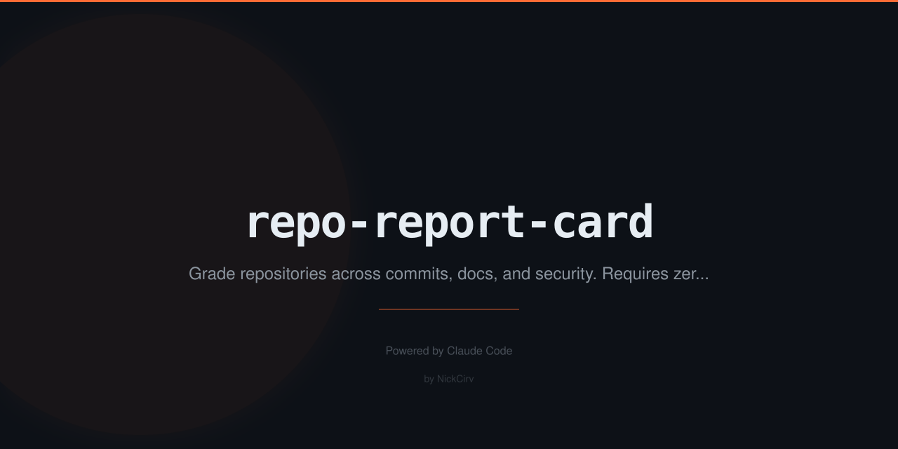

<p align="center">
  
</p>

<h1 align="center">repo-report-card</h1>
<p align="center"><strong>Your repo just got graded. How did it do?</strong></p>

<p align="center">
  <a href="#install"></a>
  
  
  
  <a href="LICENSE"></a>
</p>

<p align="center">
  <em>Letter grades for commits, docs, structure, security, and CI/CD.<br/>Like a code review — but for your entire repo.</em>
</p>

---

## The problem

You think your repo is well-maintained. But is it?

Does it have a `LICENSE`? Are your commits readable? Is there a `.env` file that shouldn't be there? Tests? CI? A `CONTRIBUTING.md`?

**repo-report-card scans your repo and gives you a letter grade. A+ to F. No opinions — just facts.**

---

## Install

```bash
npx repo-report-card              # grade current repo
npx repo-report-card ~/my-project # grade any repo
npx repo-report-card badge        # get a markdown badge for your README
```

Or install globally:

```bash
npm install -g repo-report-card
```

---

## What it looks like

```
  ╔══════════════════════════════════════╗
  ║       REPO REPORT CARD               ║
  ╚══════════════════════════════════════╝

  ██████╗
  ██╔══██╗
  ██████╔╝
  ██╔══██╗
  ██████╔╝  -
  ╚═════╝

  Overall Score: 78/100 — B-

  ─────────────────────────────────────
  Category Breakdown
  ─────────────────────────────────────
  A    Commit Hygiene      █████████░  90/100
  B+   Documentation       ████████░░  85/100
  B    Code Structure      ████████░░  80/100
  A-   Security            █████████░  88/100
  F    CI/CD               ░░░░░░░░░░  0/100

  ─────────────────────────────────────
  Top Improvements
  ─────────────────────────────────────
  1. Add GitHub Actions workflow for CI
  2. Add test directory with unit tests
  3. Add CONTRIBUTING.md for open source
```

---

## Commands

```bash
# Grade the current directory
npx repo-report-card

# Grade a specific repo
npx repo-report-card /path/to/repo

# Compare two repos side by side
npx repo-report-card compare ./frontend ./backend

# Get a badge for your README
npx repo-report-card badge
# → 

# See every individual finding
npx repo-report-card --verbose

# Output as JSON (pipe to jq, use in CI)
npx repo-report-card --format json

# Output as Markdown (paste into docs)
npx repo-report-card --format markdown

# Drill into a single category
npx repo-report-card --category commits
npx repo-report-card --category docs
npx repo-report-card --category structure
npx repo-report-card --category security
npx repo-report-card --category ci
```

---

## What gets graded

| Category | Weight | What's checked |
|----------|--------|----------------|
| **Commit Hygiene** | 20% | Conventional commits, message quality, frequency, author diversity |
| **Documentation** | 20% | README depth, LICENSE, CHANGELOG, CONTRIBUTING, docs/ directory |
| **Code Structure** | 25% | src/ directory, test files, .gitignore quality, no binaries, scripts |
| **Security** | 20% | No .env committed, no hardcoded secrets, lockfile present, sensitive patterns |
| **CI/CD** | 15% | GitHub Actions, Dockerfile, deploy configs, pre-commit hooks, linter setup |

---

## Grade scale

```
A+ (95-100) · A (90-94) · A- (85-89)
B+ (80-84)  · B (75-79)  · B- (70-74)
C+ (65-69)  · C (60-64)  · C- (55-59)
D  (40-54)  · F (0-39)
```

---

## Use in CI

Fail the build if your repo quality drops:

```yaml
- name: Grade repo
  run: |
    SCORE=$(npx repo-report-card --format json | node -e "const d=require('fs').readFileSync('/dev/stdin','utf8');console.log(JSON.parse(d).score)")
    echo "Score: $SCORE"
    if [ "$SCORE" -lt 70 ]; then echo "Quality gate failed (score < 70)"; exit 1; fi
```

---

## Why this exists

> "Good code" is subjective. "Has no LICENSE file" is a fact.

repo-report-card checks the things everyone agrees matter but nobody actually checks. Run it on your own repos. Run it on repos you're evaluating. Run it before you open source something. Drop the badge in your README.

---

## Features

- **Zero API keys** — pure local analysis of git history and repo structure
- **100% offline** — no network requests, runs in seconds
- **Compare repos** — side-by-side with winner detection
- **Badge generation** — shields.io badge ready to paste
- **Multiple output formats** — terminal, JSON, Markdown
- **Verbose mode** — every individual finding per category
- **Single category** — drill into one dimension at a time

---

## Development

```bash
git clone https://github.com/NickCirv/repo-report-card.git
cd repo-report-card
npm install
node bin/grade.js .
```

---

## License

MIT — Built by [@NickCirv](https://github.com/NickCirv)
