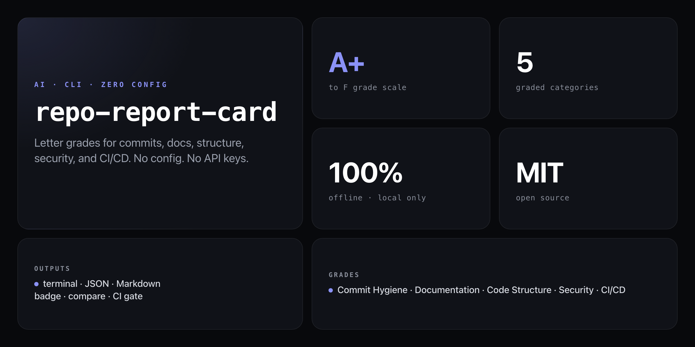

<div align="center">

**A+ to F. For your entire repo. Zero config. Zero API keys. 100% offline.**


</div>

---

"Good code" is subjective. "No LICENSE file" is a fact. `repo-report-card` checks the things everyone agrees matter but nobody actually audits — and gives you a letter grade for each.

```
  ╔══════════════════════════════════════╗
  ║       REPO REPORT CARD               ║
  ╚══════════════════════════════════════╝

  Overall Score: 78/100 — B-

  ─────────────────────────────────────
  Category Breakdown
  ─────────────────────────────────────
  A    Commit Hygiene      █████████░  90/100
  B+   Documentation       ████████░░  85/100
  B    Code Structure      ████████░░  80/100
  A-   Security            █████████░  88/100
  F    CI/CD               ░░░░░░░░░░   0/100

  ─────────────────────────────────────
  Top Improvements
  ─────────────────────────────────────
  1. Add GitHub Actions workflow for CI
  2. Add test directory with unit tests
  3. Add CONTRIBUTING.md for open source
```

## Install

No npm account required — runs straight from GitHub:

```bash
npx github:NickCirv/repo-report-card
```

## Usage

```bash
# grade the current repo
npx github:NickCirv/repo-report-card

# grade a specific repo
npx github:NickCirv/repo-report-card ~/my-project

# compare two repos side by side
npx github:NickCirv/repo-report-card compare ./frontend ./backend

# get a README badge for your repo grade
npx github:NickCirv/repo-report-card badge

# verbose: show every individual finding
npx github:NickCirv/repo-report-card --verbose

# JSON output (pipe to jq, use in CI)
npx github:NickCirv/repo-report-card --format json

# Markdown output (paste into docs)
npx github:NickCirv/repo-report-card --format markdown

# drill into a single category
npx github:NickCirv/repo-report-card --category commits
npx github:NickCirv/repo-report-card --category security
```

| Flag | Description |
|------|-------------|
| `[path]` | Repo to grade (default: current directory) |
| `-f, --format <type>` | Output format: `text`, `json`, `markdown` (default: `text`) |
| `-v, --verbose` | Show all findings per category |
| `-c, --category <name>` | Grade one category: `commits`, `docs`, `structure`, `security`, `ci` |

## What gets graded

| Category | Weight | What's checked |
|----------|--------|----------------|
| **Commit Hygiene** | 20% | Conventional commits, message quality, frequency, author diversity |
| **Documentation** | 20% | README depth, LICENSE, CHANGELOG, CONTRIBUTING, docs/ directory |
| **Code Structure** | 25% | src/ directory, test files, .gitignore quality, no binaries, scripts |
| **Security** | 20% | No .env committed, no hardcoded secrets, lockfile present, sensitive patterns |
| **CI/CD** | 15% | GitHub Actions, Dockerfile, deploy configs, pre-commit hooks, linter setup |

## Grade scale

```
A+ (95-100) · A (90-94) · A- (85-89)
B+ (80-84)  · B (75-79)  · B- (70-74)
C+ (65-69)  · C (60-64)  · C- (55-59)
D  (40-54)  · F  (0-39)
```

## Use in CI

Fail the build if repo quality drops below a threshold:

```yaml
- name: Grade repo
  run: |
    SCORE=$(npx github:NickCirv/repo-report-card --format json | node -e "const d=require('fs').readFileSync('/dev/stdin','utf8');console.log(JSON.parse(d).score)")
    echo "Score: $SCORE"
    if [ "$SCORE" -lt 70 ]; then echo "Quality gate failed (score < 70)"; exit 1; fi
```

## What it is NOT

- **Not a linter.** It audits repo-level signals (files present, commit patterns, structure) — not individual line-level code style.
- **Not a security scanner.** The security category checks for committed secrets and missing lockfiles, not OWASP vulnerabilities in your code.
- **Not a replacement for code review.** Think of it as the pre-review checklist that catches the obvious stuff so reviewers can focus on logic.

---

<div align="center">
<sub>100% offline · Node 18+ · MIT · by <a href="https://github.com/NickCirv">NickCirv</a></sub>
</div>
