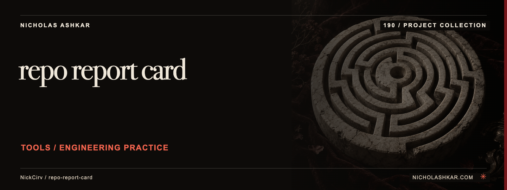

# repo-report-card

Summarize a local repository against a transparent, opinionated hygiene rubric.

Grades commits, documentation, structure, basic security patterns and CI file presence. JSON/Markdown outputs and side-by-side comparison help review the underlying findings.


<a id="install"></a>

## Quickstart

Package runtime requirement: Node.js `>=20`. Git is needed to obtain this pinned source checkout.

```bash
git clone https://github.com/NickCirv/repo-report-card.git
cd repo-report-card
git checkout 1d672e037e985aab1b063cd2c04730af03e7e562
npm install --ignore-scripts
node bin/grade.js . --format json
```

This source-derived example has not been executed in this review. The command calculates a report from the local checkout; it does not query current CI runs or execute tests.


<a id="what-gets-graded"></a>

<a id="grade-scale"></a>

## Usage

```bash
node bin/grade.js /path/to/project --category docs --verbose
node bin/grade.js compare /path/to/one /path/to/two --format json
```

`badge [path]` prints a badge string for the computed grade. Treat the findings as the useful output, not the letter alone.


<a id="what-it-is-not"></a>

## Behavior and limits

A high grade is not a certification of software quality or security. The security scanner is capped and pattern-based; its `.env` finding tests file existence, not whether Git tracks the file. CI checks inspect configuration, not successful runs. Comparison is meaningful only with these rubric limitations understood.


<a id="use-in-ci"></a>

## Development

Declared package scripts:

| Script | Command |
| --- | --- |
| `start` | `node bin/grade.js` |
| `lint` | `node --check src/*.js bin/grade.js` |
| `test` | `node --test` |

The captured smoke test only asks Node to syntax-check the entrypoint. It does not exercise behavior, integrations or failure paths. Neither that test nor installation was run in this review.

Current CI results and maintenance response times were not verified.

## Documentation

[Command and behavior reference](docs/REFERENCE.md) explains the options, output and interpretation.

[Source review and claim ledger](docs/RESEARCH.md) records revision `1d672e037e98`, inspected files and verification gaps.

## License and attribution

Protected license and attribution files remain unchanged: [LICENSE](https://github.com/NickCirv/repo-report-card/blob/1d672e037e985aab1b063cd2c04730af03e7e562/LICENSE).

[Artwork credits](assets/nicholas-ashkar/CREDITS.md) · [Nicholas Ashkar — consulting](https://nicholashkar.com/#oxblood-contact)
